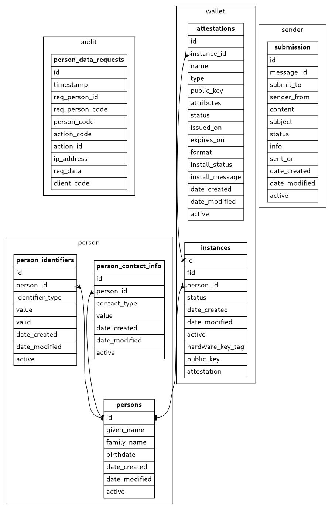

Datu bāzes modelis

## Shēma audit

### Tabula audit.person_data_requests

Personas datu audits

| Nosaukums | Tips | Garums | Obligāts | Noklusētā vērtība | Apraksts |
| --------- | ---- | ------ | -------- | ----------------- | -------- |
| **id** | **bigint** |  | **Jā** | **Ģenerēta** | **Ieraksta identifikators** |
| timestamp | timestamp with time zone |  | Jā | CURRENT_TIMESTAMP | Laika zīmogs |
| req_person_id | character varying | 250 | Nē |  | Datu pieprasītāja identifikators |
| req_person_code | character varying | 50 | Nē |  | Datu pieprasītāja personas kods |
| person_code | character varying | 50 | Jā |  | Personas kods |
| action_code | character varying | 50 | Jā |  | Darbības kods |
| action_id | bigint |  | Nē |  | Darbības saistītais identifikators |
| ip_address | inet |  | Nē |  | Pieprasītāja IP adrese |
| req_data | jsonb |  | Nē |  | Papildus datu pieprasītāja dati (firstName, lastName) |
| client_code | character varying | 250 | Nē |  | Izsaucēja klienta kods |

### Funkcijas un procedūras

* Procedūra `audit.audit_person_data (IN pi_data text, INOUT po_data text) record`

Personas datu audita ieraksta izveidošana autorizētam lietotājam

* Procedūra `audit.audit_person_data (IN pi_req_person_id character varying, IN pi_req_person_code character varying, IN pi_req_person_first_name character varying, IN pi_req_person_last_name character varying, IN pi_req_org_regnum character varying, IN pi_req_org_title character varying, IN pi_person_code character varying, IN pi_action_code character varying, IN pi_action_id bigint, IN pi_ip_address inet) `

Personas datu audita ieraksta izveidošana

* Procedūra `audit.create_audit_partition (IN pi_for_date date) `

Personas datu audita tabulas nodalījuma izveidošana norādītajam datumam

* Funkcija `audit.get_legal_entity_prefix (number_length integer) varchar`

Juridiskās personas koda prefikss

* Funkcija `audit.get_physical_person_prefix () varchar`

Fiziskās personas koda prefikss

* Procedūra `audit.insert_person_data_request (INOUT pi_data audit.person_data_requests) record`

Saglabā personas datu pieprasījumu

## Shēma person

Personas shēma

### Tabula person.person_contact_info

Personu kontakta informācija

| Nosaukums | Tips | Garums | Obligāts | Noklusētā vērtība | Apraksts |
| --------- | ---- | ------ | -------- | ----------------- | -------- |
| **id** | **bigint** |  | **Jā** | **Ģenerēta** | **Ieraksta identifikators** |
| person_id | character varying | 26 | Jā |  | Saistītā persona (atsauce uz [person.persons.id](#tabula-personpersons)) |
| contact_type | character varying | 50 | Jā |  | Kontakta tips (email, phone) |
| value | character varying | 100 | Jā |  | Identifikatora vērtība |
| date_created | timestamp with time zone |  | Jā | CURRENT_TIMESTAMP | Ieraksta izveides datums |
| date_modified | timestamp with time zone |  | Nē |  | Ieraksta labošanas datums |
| active | boolean |  | Nē | true | Pazīme, vai ieraksts ir aktīvs |

### Tabula person.person_identifiers

Personas identifikatoru veidi

| Nosaukums | Tips | Garums | Obligāts | Noklusētā vērtība | Apraksts |
| --------- | ---- | ------ | -------- | ----------------- | -------- |
| **id** | **bigint** |  | **Jā** | **Ģenerēta** | **Ieraksta identifikators** |
| person_id | character varying | 26 | Jā |  | Saistītā persona (atsauce uz [person.persons.id](#tabula-personpersons)) |
| identifier_type | character varying | 50 | Jā |  | Identifikatora tips |
| value | character varying | 100 | Jā |  | Identifikatora vērtība |
| valid | boolean |  | Nē | true | Pazīme vai identifikators ir derīgs |
| date_created | timestamp with time zone |  | Jā | CURRENT_TIMESTAMP | Ieraksta izveides datums |
| date_modified | timestamp with time zone |  | Nē |  | Ieraksta labošanas datums |
| active | boolean |  | Nē | true | Pazīme, vai ieraksts ir aktīvs |

### Tabula person.persons

Personu tabula

| Nosaukums | Tips | Garums | Obligāts | Noklusētā vērtība | Apraksts |
| --------- | ---- | ------ | -------- | ----------------- | -------- |
| **id** | **character varying** | **26** | **Jā** | **generate_ulid()** | **Ieraksta identifikators** |
| given_name | character varying | 100 | Jā |  | Vārds |
| family_name | character varying | 100 | Jā |  | Uzvārds |
| birthdate | date |  | Nē |  | Dzimšanas datums |
| date_created | timestamp with time zone |  | Jā | CURRENT_TIMESTAMP | Ieraksta izveides datums |
| date_modified | timestamp with time zone |  | Nē |  | Ieraksta labošanas datums |
| active | boolean |  | Nē | true | Pazīme, vai ieraksts ir aktīvs |

### Funkcijas un procedūras

* Procedūra `person.delete_person (IN pi_data jsonb, INOUT po_data jsonb) record`

Izdzēš personu un visas ar viņu saistīto informāciju

* Procedūra `person.get_person (IN pi_data jsonb, INOUT po_data jsonb) record`

Atgriež personas datus

* Funkcija `person.get_person_data (pi_person_id character varying) jsonb`

Atgriež personas datus

* Funkcija `person.get_person_id_by_code (pi_value character varying) varchar`

Atrod personu pēc personas koda

* Procedūra `person.get_person_id_by_code (IN pi_data jsonb, INOUT po_data jsonb) record`

Atrod personu pēc personas koda

* Funkcija `person.get_person_id_by_guid (pi_value character varying) varchar`

Atrod personu pēc personas GUID

* Procedūra `person.save_person (IN pi_data jsonb, INOUT po_data jsonb) record`

Saglabā personas datus

## Shēma sender

E-pasta un īsziņas sūtīšanas shēma

### Tabula sender.submission

E-pasta un īsziņas sūtīšanas ieraksti

| Nosaukums | Tips | Garums | Obligāts | Noklusētā vērtība | Apraksts |
| --------- | ---- | ------ | -------- | ----------------- | -------- |
| **id** | **character varying** | **26** | **Jā** | **generate_ulid()** | **Ieraksta identifikators** |
| message_id | character varying | 26 | Nē |  | Ziņas ārējais identifikators |
| submit_to | character varying | 100 | Jā |  | Saņēmēja dati |
| sender_from | json |  | Jā |  | Sūtītāja dati |
| content | json |  | Jā |  | Ziņas saturs |
| subject | character varying | 255 | Jā |  | Ziņas priekšmets |
| status | character varying | 50 | Jā |  | Ziņas statuss |
| info | text |  | Nē |  | Ziņas statusa papildus informācija |
| sent_on | timestamp with time zone |  | Nē |  | Ziņas izsūtīšanas datums |
| date_created | timestamp with time zone |  | Jā | CURRENT_TIMESTAMP | Ieraksta izveides datums |
| date_modified | timestamp with time zone |  | Nē |  | Ieraksta labošanas datums |
| active | boolean |  | Nē | true | Pazīme, vai ieraksts ir aktīvs |

### Funkcijas un procedūras

* Procedūra `sender.get_submission_status (IN pi_data jsonb, INOUT po_data jsonb) record`

Atgriež sūtījuma statusu

* Procedūra `sender.save_submission_data (IN pi_data jsonb, INOUT po_data jsonb) record`

Saglabā sūtījuma datus

* Procedūra `sender.update_submission_status (IN pi_data jsonb, INOUT po_data jsonb) record`

Atjauno sūtījuma statusu

## Shēma session

Sesijas shēma

### Funkcijas un procedūras

* Procedūra `session.create (IN pi_id character varying, IN pi_user_id character varying, IN pi_user_code character varying, IN pi_given_name character varying, IN pi_family_name character varying, IN pi_role_code character varying, IN pi_ip_addr inet) `

Lietotāja sesijas stāvokļa uzstādīšana

* Funkcija `session.get_user_data () record`

Uzstādītās sesijas lietotāja detaļas

## Shēma util

### Funkcijas un procedūras

* Funkcija `util.to_date (pi_date character varying) date`

String datuma konvertēšana uz date

* Funkcija `util.to_timestamp (pi_date character varying) timestamp`

String datuma konvertēšana uz timestamp without time zone

* Funkcija `util.to_timestamp_with_tz (pi_date character varying) timestamptz`

String datuma konvertēšana uz timestamp with time zone

## Shēma wallet

Digitālā maka shēma

### Tabula wallet.attestations

Digitālā maka attestācijas

| Nosaukums | Tips | Garums | Obligāts | Noklusētā vērtība | Apraksts |
| --------- | ---- | ------ | -------- | ----------------- | -------- |
| **id** | **uuid** |  | **Jā** |  | **Ieraksta identifikators** |
| instance_id | character varying | 26 | Jā |  | Firebase instalācijas identifikators (atsauce uz [wallet.instances.id](#tabula-walletinstances)) |
| name | character varying | 30 | Nē |  | Ieraksta nosaukums |
| type | character varying | 50 | Nē |  | Ierakstsa tips |
| public_key | text |  | Jā |  | Attestācijas publiskā atslēga |
| attributes | jsonb |  | Nē |  | Attestācijas atribūti |
| status | character varying | 26 | Jā | 'active'::character varying | Status ("active", "suspended", "revoked", "expired") |
| issued_on | timestamp with time zone |  | Jā |  | Izsniegšanas datums |
| expires_on | timestamp with time zone |  | Nē |  | Derīguma termiņa beigas |
| format | character varying | 30 | Nē |  | Attestācijas formāts ("mDoc", "SD-JWT-VC") |
| install_status | character varying | 26 | Jā |  | Instalācijas status ("sent", "success", "error", "waiting_wi") |
| install_message | character varying | 300 | Nē |  | Instalācijas papildus informācija |
| date_created | timestamp with time zone |  | Jā | CURRENT_TIMESTAMP | Ieraksta izveides datums |
| date_modified | timestamp with time zone |  | Nē |  | Ieraksta labošanas datums |
| active | boolean |  | Nē | true | Pazīme, vai ieraksts ir aktīvs |

### Tabula wallet.instances

Digitālā maka instances

| Nosaukums | Tips | Garums | Obligāts | Noklusētā vērtība | Apraksts |
| --------- | ---- | ------ | -------- | ----------------- | -------- |
| **id** | **character varying** | **26** | **Jā** | **generate_ulid()** | **Ieraksta identifikators** |
| fid | character varying | 255 | Nē |  | Firebase instalācijas identifikators |
| person_id | character varying | 26 | Nē | NULL::character varying | Saistītā persona (atsauce uz [person.persons.id](#tabula-personpersons)) |
| status | character varying | 26 | Jā | 'active'::character varying | Status ("active", "suspended", "revoked", "expired") |
| date_created | timestamp with time zone |  | Jā | CURRENT_TIMESTAMP | Ieraksta izveides datums |
| date_modified | timestamp with time zone |  | Nē |  | Ieraksta labošanas datums |
| active | boolean |  | Jā | true | Pazīme, vai ieraksts ir aktīvs |
| hardware_key_tag | character varying | 50 | Jā |  | Unikāls instances iekārtas atslēgas identifikators |
| public_key | text |  | Jā |  | PEM kodēta aparatūras glabātuves izsniegta publiskā atslēga, kas ir specifiska šai instancei |
| attestation | jsonb |  | Nē |  | Papildus atestācijas dati uz instances inicializācijas brīdi |

### Funkcijas un procedūras

* Procedūra `wallet.create_instance (IN pi_data jsonb, INOUT po_data jsonb) record`

Saglabā jaunu instances ierakstu

* Procedūra `wallet.delete_inactive_instances (IN pi_data jsonb, INOUT po_data jsonb) record`

Izdzēš pagaidu instances

* Procedūra `wallet.get_attestation_list (IN pi_data jsonb, INOUT po_data jsonb) record`

Atgriež sarakstu ar attribūtu kopām

* Procedūra `wallet.get_instance_by_tag (IN pi_data jsonb, INOUT po_data jsonb) record`

Atgriež maka instances datus un personas datus pēc atslēgas identifikatora

* Funkcija `wallet.get_instance_data (pi_hardware_key_tag character varying) jsonb`

Atgriež instances datus

* Procedūra `wallet.get_instance_list (IN pi_data jsonb, INOUT po_data jsonb) record`

Atgriež sarakstu ar instances ierakstiem

* Procedūra `wallet.get_public_key (IN pi_data jsonb, INOUT po_data jsonb) record`

Atgriež publisko atslēgu un personu pēc atslēgas identifikatora

* Procedūra `wallet.public_get_attestation_list (IN pi_data jsonb, INOUT po_data jsonb) record`

Atgriež instances statusu ar tās atribūtiem

* Procedūra `wallet.public_update_attestation_status (IN pi_data jsonb, INOUT po_data jsonb) record`

Atjauno attribūtu statusu

* Funkcija `wallet.update_attestation_status (pi_data record, pi_status character varying) jsonb`

Atjauno attribūtu statusu

* Procedūra `wallet.update_attestation_status (IN pi_data jsonb, INOUT po_data jsonb) record`

Atjauno attribūtu statusu

* Procedūra `wallet.update_instance_status (IN pi_data jsonb, INOUT po_data jsonb) record`

Atjauno instances statusu

