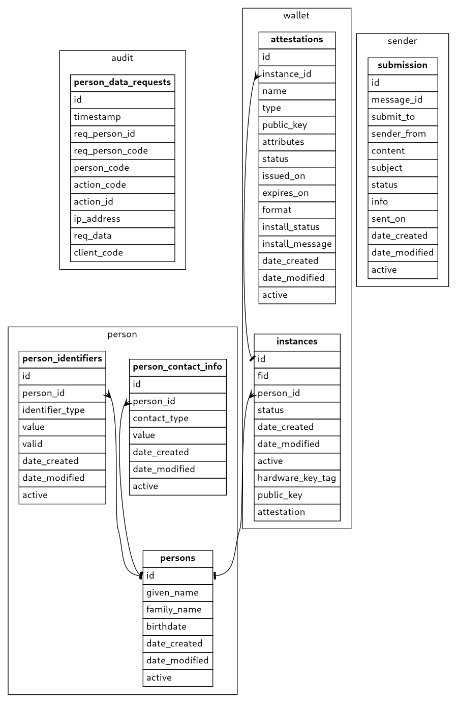

# EDIM Database

Edim database, [description here](./DOCUMENTATION.md)

## Database model

Generated database model

## Deployment

Database contains two submodules located in `submodules` folder

Use [evolve](https://evolve-db.netlify.app/) to deploy. Need to run for submodules aswell.
